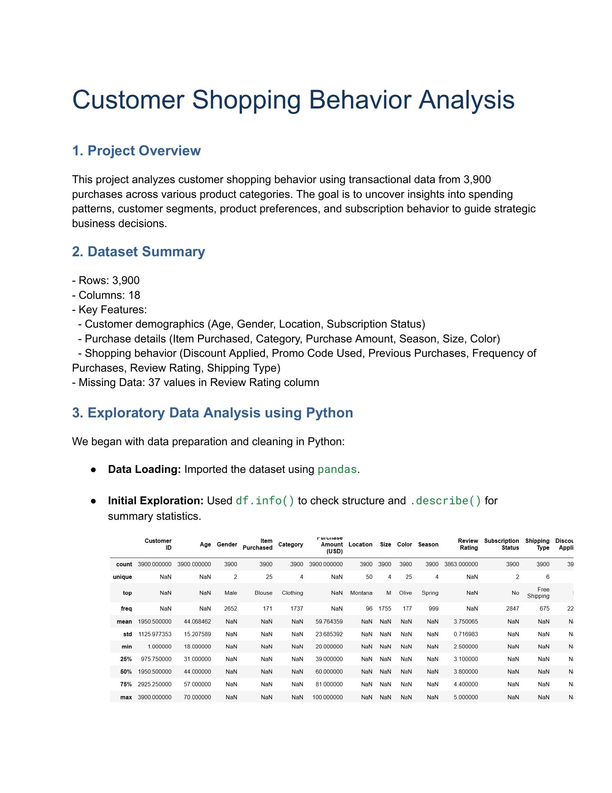
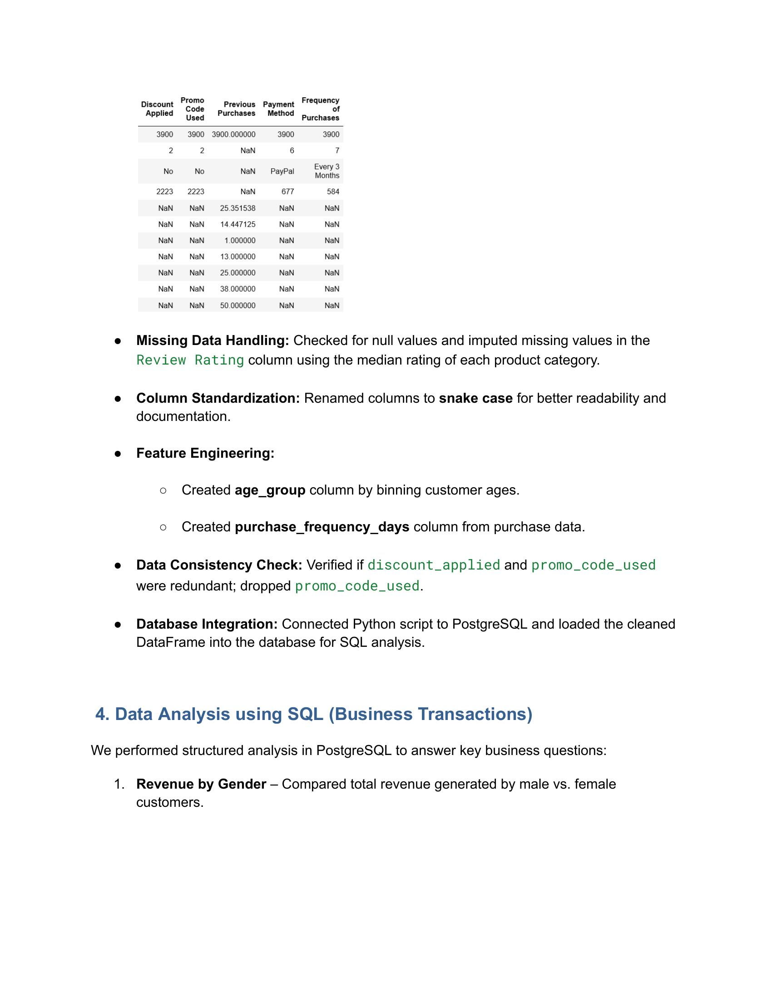
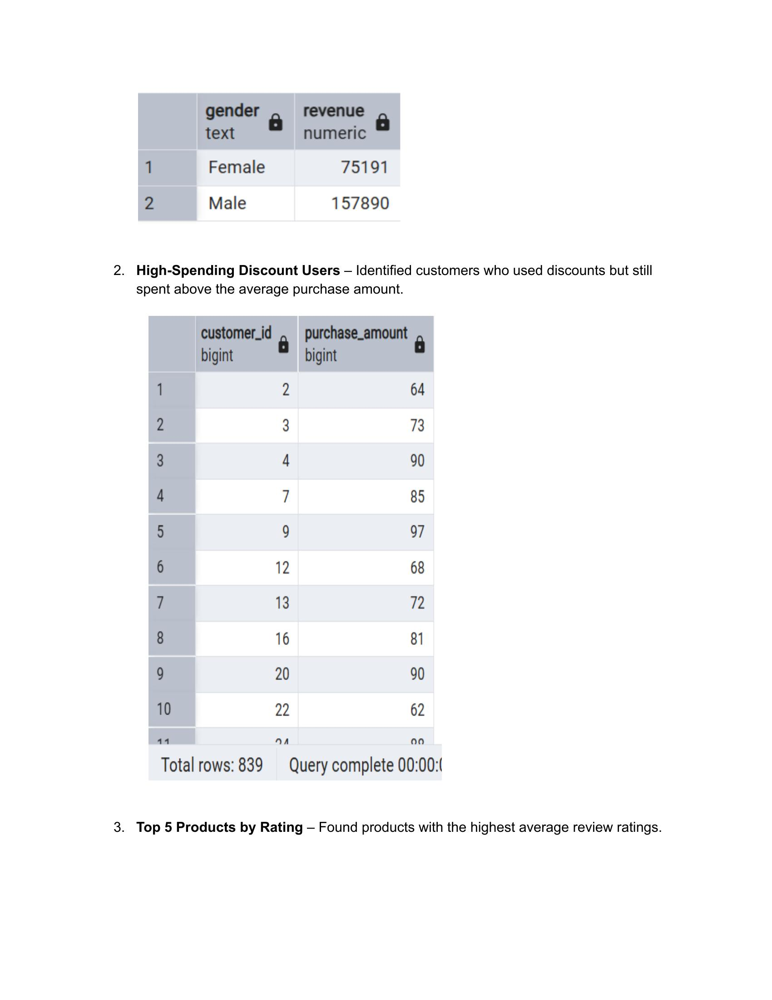
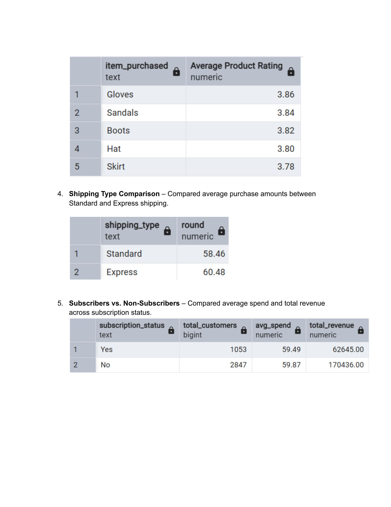
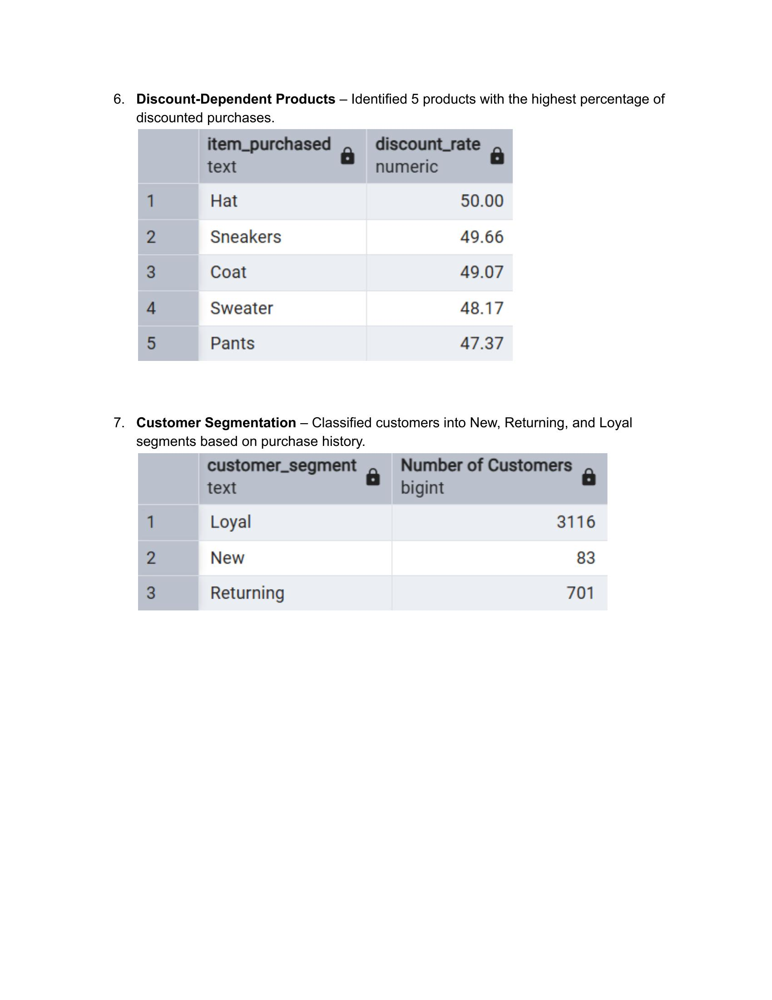
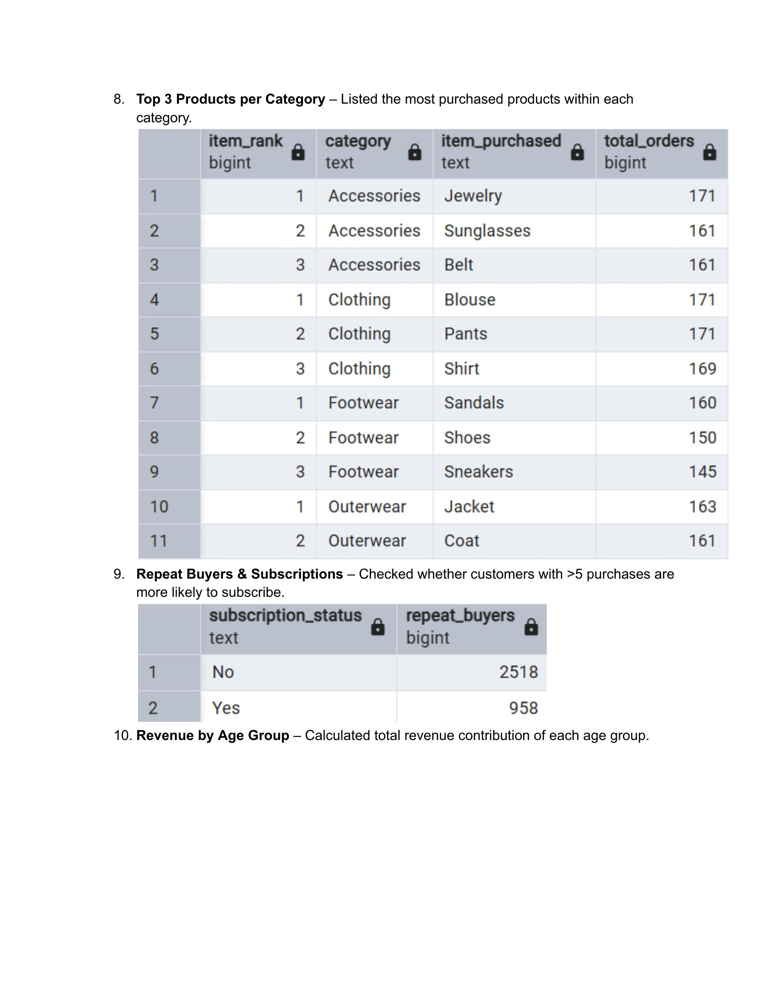
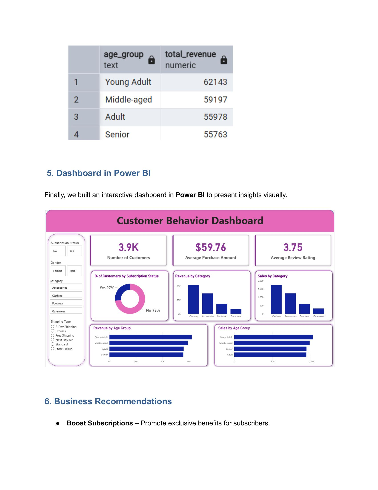
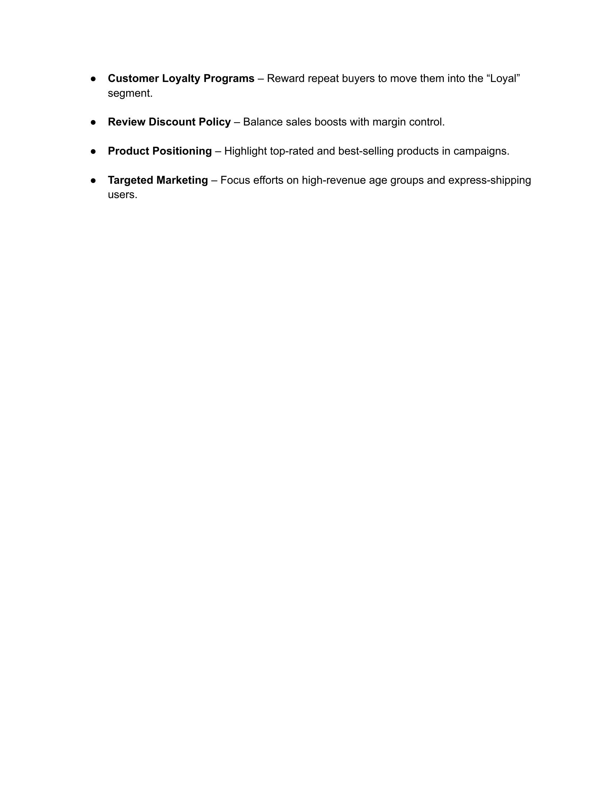

<div align="center">


<p>
  
  
  
  
  
</p>

<p>
  
  
  
  
  
</p>

<br/>

> *"Turning raw transactional data into strategic business intelligence — one query at a time."*
>
> **— Fateh Sayyed**

</div>

---

## 📌 Overview

This project delivers a **full-stack data analytics pipeline** on customer shopping behavior — covering raw data ingestion, Python-based EDA, SQL-driven business analysis via PostgreSQL, and an interactive Power BI dashboard. Built on **3,900 real purchase transactions** across 4 product categories, the project surfaces actionable insights into customer segments, spending patterns, discount dependency, and subscription behavior.

---

## ⚡ Key Metrics

<div align="center">

| 👥 Total Customers | 💰 Avg Purchase | ⭐ Avg Rating | 📋 Subscription Rate |
|:-:|:-:|:-:|:-:|
| **3,900** | **$59.76** | **3.75 / 5.0** | **27% (1,053)** |

</div>

---

## 📁 Repository Structure

```
📦 customer-shopping-behavior-analysis/
│
├── 📓 customer_shoping.ipynb                    # Python EDA Notebook
├── 📄 Customer_Shopping_Behavior_Analysis.pdf   # Full Analysis Report
├── 📊 SALES_REPORT.pbix                         # Power BI Dashboard
├── 📋 README.md                                 # Project Documentation
└── 📂 shopping_assets/                          # Screenshots & Visual Assets
    ├── eda_overview.jpg
    ├── eda_cleaning.jpg
    ├── sql_revenue_gender.jpg
    ├── sql_ratings_shipping.jpg
    ├── sql_discount_segments.jpg
    ├── sql_top_products_age.jpg
    ├── powerbi_dashboard.jpg
    └── recommendations.jpg
```

---

## 🔄 Project Pipeline

```
Raw CSV Data
     │
     ▼
┌─────────────────────┐
│  Python EDA         │  ← pandas, data cleaning, feature engineering
│  (Jupyter Notebook) │
└─────────────────────┘
     │
     ▼
┌─────────────────────┐
│  PostgreSQL         │  ← 10 business queries, customer segmentation
│  (SQL Analysis)     │
└─────────────────────┘
     │
     ▼
┌─────────────────────┐
│  Power BI           │  ← Interactive dashboard, KPI cards, slicers
│  (Dashboard)        │
└─────────────────────┘
     │
     ▼
  Business Recommendations
```

---

## 🐍 Phase 1 — Python EDA (`customer_shoping.ipynb`)

### 📊 Dataset Overview & Descriptive Statistics



The analysis begins with a thorough exploration of the dataset structure. Key statistical measures reveal a mean purchase amount of **$59.76**, customer ages ranging from **18–70** (median: 44), and review ratings between **2.5–5.0** (mean: 3.75).

---

### 🧹 Data Cleaning & Feature Engineering



**Steps performed:**

- **Missing Data** — 37 null values in `Review Rating` imputed using **category-level median** to preserve distribution integrity
- **Column Standardization** — All column names renamed to `snake_case` for clean SQL compatibility
- **Feature Engineering** — Created `age_group` (quartile binning) and `purchase_frequency_days` (mapped from frequency labels)
- **Redundancy Check** — Verified `discount_applied` and `promo_code_used` were identical; dropped `promo_code_used`
- **Database Integration** — Exported cleaned DataFrame to **PostgreSQL** via SQLAlchemy for SQL-layer analysis

---

## 🗄️ Phase 2 — SQL Analysis (PostgreSQL)

10 structured business queries executed against the cleaned dataset loaded into PostgreSQL.

---

### 📊 Query 1 & 2 — Revenue by Gender + High-Spending Discount Users



> **Male customers** drove **$157,890** in total revenue vs **$75,191** for female — a 2.1x gap. Despite heavy discounting, **839 discount users** still spent above the average, showing discounts do not necessarily erode spending power.

---

### ⭐ Query 3 & 4 — Top Products by Rating + Shipping Comparison



> **Gloves** top the rating charts at **3.86**, followed by Sandals (3.84) and Boots (3.82). On shipping, **Express** customers spend slightly more ($60.48) vs Standard ($58.46) — a marginal but notable difference.

---

### 🏷️ Query 5 & 6 — Subscribers vs Non-Subscribers + Discount-Dependent Products



> Subscribers (1,053) average **$59.49** vs non-subscribers (2,847) at **$59.87** — nearly identical, meaning subscriptions don't currently drive higher spend. **Hat** leads discount dependency at **50%**, followed by Sneakers (49.66%) and Coat (49.07%).

---

### 📦 Query 7–10 — Customer Segments, Top Products per Category, Repeat Buyers & Age Revenue



> An overwhelming **80% of customers (3,116)** are **Loyal**, with 701 Returning and only 83 New — strong retention but a weak acquisition funnel. **Young Adults** contribute the highest revenue at **$62,143**. Critically, **2,518 repeat buyers are non-subscribers** — a massive conversion opportunity.

---

## 📊 Phase 3 — Power BI Dashboard

### 🖥️ Customer Behavior Dashboard



The interactive Power BI dashboard features:

- **KPI Cards** — Total Customers (3.9K), Average Purchase Amount ($59.76), Average Review Rating (3.75)
- **Subscription Donut** — 27% subscribers vs 73% non-subscribers
- **Revenue by Category** — Clothing leads, followed by Accessories, Footwear, Outerwear
- **Sales by Category** — Order volume mirrors revenue rankings
- **Revenue by Age Group** — Young Adult dominates at $62K total
- **Sales by Age Group** — Young Adults lead in transaction count
- **Slicers** — Filter by Subscription Status, Gender, Category, Shipping Type

---

## 💡 Business Recommendations



```
📌 SUBSCRIPTIONS
━━━━━━━━━━━━━━━━━━━━━━━━━━━━━━━━━━━━━━━━━━━━━━━━━━━━━━━━━━━━━
  Only 27% subscribe despite 80% being loyal buyers.
  → Launch exclusive subscriber perks (early access, free shipping).
  → Target 2,518 non-subscriber repeat buyers for conversion.

📌 CUSTOMER LOYALTY
━━━━━━━━━━━━━━━━━━━━━━━━━━━━━━━━━━━━━━━━━━━━━━━━━━━━━━━━━━━━━
  3,116 loyal customers (80%) — the strongest business asset.
  → Build tiered loyalty programs to retain and upsell.
  → New customers (only 83) need targeted acquisition campaigns.

📌 DISCOUNT STRATEGY
━━━━━━━━━━━━━━━━━━━━━━━━━━━━━━━━━━━━━━━━━━━━━━━━━━━━━━━━━━━━━
  Hat, Sneakers, Coat, Sweater, Pants have ~47-50% discount rates.
  → Reassess discount policy for margin sustainability.
  → Use discounts strategically for new customer acquisition only.

📌 PRODUCT & MARKETING
━━━━━━━━━━━━━━━━━━━━━━━━━━━━━━━━━━━━━━━━━━━━━━━━━━━━━━━━━━━━━
  Top-rated: Gloves (3.86), Sandals (3.84), Boots (3.82).
  → Feature high-rated items prominently in all campaigns.
  → Focus marketing on Young Adults — highest revenue segment.
  → Express shipping users spend more → promote premium shipping.
```

---

## 🛠️ Tech Stack

| Layer | Tool | Purpose |
|-------|------|---------|
| **Data Wrangling** | Python, Pandas, NumPy | Cleaning, imputation, feature engineering |
| **Notebook** | Jupyter Notebook | EDA, code documentation |
| **Database** | PostgreSQL + SQLAlchemy | Business query analysis |
| **Visualization** | Matplotlib, Seaborn | EDA charts |
| **BI Dashboard** | Microsoft Power BI | Executive dashboard |
| **Version Control** | Git & GitHub | Source management |

---

## 🚀 Getting Started

### Prerequisites
```bash
Python >= 3.10
PostgreSQL >= 14
Power BI Desktop
Jupyter Notebook / JupyterLab
```

### Setup
```bash
# 1. Clone the repository
git clone https://github.com/fatehSayyed/Customer_Behavior_Analysis

# 2. Move into the directory
cd customer-shopping-behavior-analysis

# 3. Install dependencies
pip install pandas numpy matplotlib seaborn sqlalchemy psycopg2 jupyter

# 4. Create the PostgreSQL database
psql -U postgres -c "CREATE DATABASE shopping;"

# 5. Launch the notebook
jupyter notebook customer_shoping.ipynb
```

### Opening the Power BI Dashboard
1. Install **[Power BI Desktop](https://powerbi.microsoft.com/desktop/)** (free)
2. Open `SALES_REPORT.pbix`
3. Use slicers to filter by **Gender**, **Category**, **Subscription Status**, **Shipping Type**

---

## 🔮 Future Enhancements

- [ ] 🤖 Customer churn prediction model (Logistic Regression / XGBoost)
- [ ] 🧠 RFM-based advanced customer segmentation
- [ ] 📦 Market basket / product affinity analysis
- [ ] 📈 Time-series revenue forecasting (Prophet / ARIMA)
- [ ] 🔄 Automated ETL pipeline with Apache Airflow
- [ ] 🌍 Geographic revenue heatmap by state/region

---

## 👨‍💻 Author

<div align="center">

### **Fateh Sayyed**

[](https://github.com/fateh-sayyed)
[](https://linkedin.com/in/fateh-sayyed)
[](https://fateh-sayyed.github.io)

*Data Analyst · Python · SQL · Power BI · EDA*

> *"Data is not just numbers — it's the story of every decision waiting to be made."*

</div>


### ⭐ Found this helpful? Give it a star — it really helps!

**© 2024 Fateh Sayyed · Customer Shopping Behavior Analysis**


</div>
